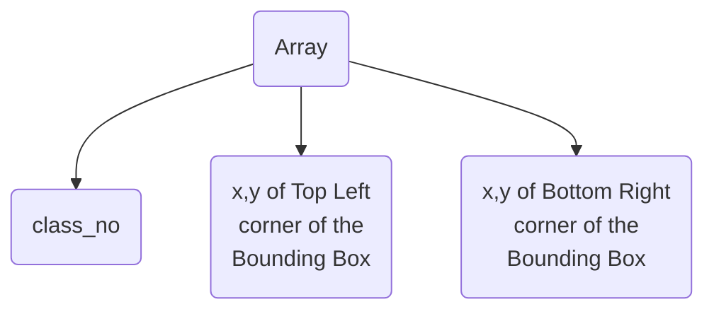

+++
title = "arrow_infer"
description = "ROS2 package for sensor data visualization through Foxglove using Atmega 328p" 
weight = 1
+++
# arrow_infer

**arrow_infer is a ROS2(foxy) package which uses YOLOv5 detetion model for inferring arrow symbols. It runs the detection model on the host machine running the ROS2 node and publishes the bounding box coordinates with it's inferred class to a topic.**

*Requires Python>=3.8 for YOLOv5*


## Installation

Install the dependencies for `YOLOv5`
```
cd arrow_infer
pip install -r requirements.txt
```
*Note: Installing in a virtual environment like `venv` or `virtualenv` won't work because ros2 runs scripts from native environment even if you running it from a virtual environment shell.*

Build the package
```
cd ../../
rosdep install -i --from-path src --rosdistro foxy -y
colcon build --symlink-install 
```
*Note: Building with `--symlink-install` is important because there are sub-directories in the package and not just scripts. Running without this argument will only build the scripts and not the sub-directories.*

## Using the Package

Source the overlay(assuming you have already sourced the underlay)
```
source install/setup.bash
```
Run the node 
```
ros2 run arrow_infer yolov5_node
```

**Things to consider before you run the node**
* The default video feed will taken from /dev/video0
* The default image size of the video frames is 192x256
* Place your trained weight in the directory where you are running the node from. Best to keep it in the workspace directory.
* Name your weight as 'best.pt'.

>The default device can be changed by making changes to the main.py script in the package. Just edit out the source parameter in the \_\_init\_\_ method
>for the device of your choice.

>Same is the case for other defaults.

>I might add ros-params feature to the package in the future to make this change dynamic

### Topic
The inferred details are published to the /inference topic.
When topic is echoed, we get an array as a message of the following format 
```
| Index of the array |                        Data                              |
|:------------------:|----------------------------------------------------------|
|0                   | Class number inferred from the weight                    |
|1                   | x co-ordinate of top left corner of the bounding box     |
|2                   | y co-ordinate of top left corner of the bounding box     |
|3                   | x co-ordinate of bottom right corner of the bounding box |
|4                   | y co-ordinate of bottom right corner of the bounding box |
```

